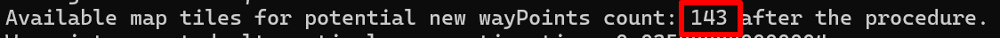
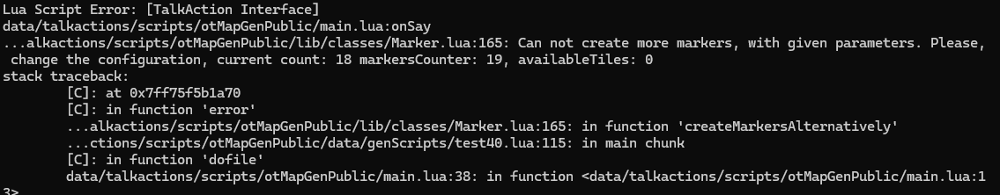
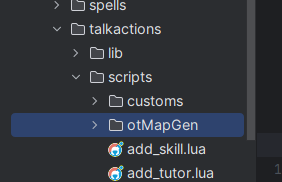
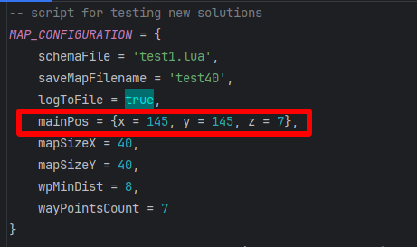
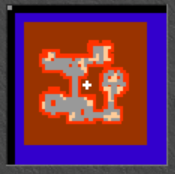

# Abcq/Acedb Map Generator
### version 0.0.5 (alpha)

## The Goal:
The goal of this script/app is to provide a tool for map generation for Open Tibia Servers.
It can likely work as part of any TFS version and also can be run
independently, directly from CLI.

It was mostly designed to generate tomb like dungeons, but can be extended to various purposes.

## Personal note:
The core of this tool was created over 10 years ago, as fun project when I was not
even an IT student. It still contains much legacy in some areas, in the code, and it's in general messy. Please don't judge me :)

And also, please note that this is an alpha version.

## Requirements:

- Lua 5.1 installed or probably any TFS 1.x version (was tested on 1.5 downgrade 8.6 by Nekiro)
- LuaJit (optional but recommended to speed up the generation process)
- It can be downgraded to work on TFS 0.3.4 - 0.4.x (was originally implemented on 0.3.4-pl1, just check ```lib/mockFunctions.lua``` and search for "```-- tfs function call, depends on tfs version```" comments)

## Usage:
### - CLI:
``` Lua main.lua <params_list_separated_by_comma> cli```\
where ```<params_list_separated_by_comma>``` look like:\
```<generation_script_filename>,<mode>,<optional_save_param>```
- ```<generation_script_filename>``` - specific filename of the script from data/genScripts/
    directory (without ".lua"), which we want to run
  - e.g. "```test40```"
- ```<mode>``` in cli run mode it's constant "```tableMode```" always
- ```<optional_save_param>``` optional param, determining do we want to save map
    after the generation process or not. If yes, value is "```save```". Expected in CLI mode.
#### Examples:
- ```Lua main.lua test40,save cli```
- ```Luajit main.lua test40,save cli``` (if LuaJIT being used)

#### Note: Using LuaJIT can decrease execution time by 2-3 times or more. Check: https://luajit.org/install.html

### - TFS, talkaction (on running server):

Depending on your usage/implementation, for talkaction it would be for example like this:\
```/genMap <params_list_separated_by_comma>```\
where ```<params_list_separated_by_comma>``` look like:\
```<generation_script_filename>,<mode>,<optional_save_param>```
- ```<generation_script_filename>``` - specific filename of the script from data/genScripts/
  directory (without ".lua"), which we want to run
    - e.g. "```test40```"
- ```<mode>``` optional, if set to ```tableMode``` it will firstly generate the map items
under the global table variable, which will represent all new items on the map and later based on this data
create the actual items on the map.
Otherwise, it will create items on map during the generation process, in just one step.
Which way to use depends on your specific needs (tableMode is incredibly faster).
- ```<optional_save_param>``` optional param, determining do we want to save generated map
  after the process. If yes, value is "```save```". The generated file will appear in the TFS root directory.
#### Examples:
- ```/genMap test40,save```
- ```/genMap test40,tableMode,save```

#### Erasing generated map (only in TFS, you need to provide generation script file - the same, which was used for generation):
- ```/genMap test40,erase```

### Credentials of resources used:
- Zbizu: https://github.com/Zbizu/map_generator-old-/tree/master (file loader code)
- Capaverde, Zbizu: https://otland.net/threads/savemap-function-saves-it-to-a-new-otbm.193781 (saving maps to .otbm)
- Kikito: https://github.com/kikito/ansicolors.lua (ansicolors, added, but currently not being used)
- Bluebird75: https://github.com/bluebird75/luaunit (lua unit test framework)
- Core Lua 5.1 Logging

### Todos:
- improved logging, for example (with asci colors):

print(ANSICOLORS('%{red}hello'))\
print(ANSICOLORS('%{redbg}hello%{reset}'))\
print(ANSICOLORS('%{bright red underline}hello'))

- the ability to erase the generated map area (actually a way to restart the process in running TFS)
- add more generation scripts
- ensure OOP MapSaver works
- more optimization
- more functionalities like for example creating small architectures
- isles generation
- whole mountains generation with caves/tunnels
- multi-floor map generation
- saving map does not work, when generation script is written
to be run "without-tfs-freeze" way - saves the map before any item is being created.
- remove many unnecessary prints from the code

### Known bugs:
- when run in CLI mode borders are placed over carpet brushes
- wall border bug occurs when generating small maps with rooms close to each other:

- in some cases, structures may block the player's path:

In some rare edge cases it can generate the dungeon, which can not be explored fully
- generating map in TFS, requires restarting TFS each time (at least that's what I remember)
- don't know why, but tableMode in TFS does not work in some scenarios (have no time to investigate it)

## How to develop / modify / extend generation scripts:
I suggest to start with copying some existing file inside data/genScripts and then modifying it up to your preferences.
Just be aware, that:
```
mapSizeX = 70,
mapSizeY = 70,
wpMinDist = 11,
wayPointsCount = 18
```
are strictly correlated with each other.
Beginning from the end "wayPointsCount" determines how many rooms will be placed on map and
"wpMinDist" determines the minimum distance between them, so if mapSizeX and mapSizeY multiplicity gives
not enough space to handle the number of rooms, generation will simply fail one way or another.

To achieve the best results, combine these parameters the way that will allow you to be still able to
generate map and make sure that the map will not be empty of rooms, tunnels etc.

As a guide you can watch the number log message:

It should not be too high, but also at the same time it can not be too low if your goal is to achieve
repeating successful generation results.

If it is too high, increase the number of rooms (wayPointsCount) or decrease the minimal distance between them (wpMinDist).
Otherwise, if it's too low, decrease the number of rooms or increase the minimal distance between them.

Other similar issue can happen if it wont be able to create requested by you markers count in generation script -
calls of the ``Marker:createMarkersAlternatively(...)`` function.

Example output (if it happens rarely, you can test your luck and generate map again, from scratch):



If ``Available map tiles for potential new markers count: 7 after the procedure.`` output will print low number
(near to 0, lower then 5, 10 smth like that) frequently, please reconsider decreasing
the value of ``minDistanceBetweenTwoMarkers`` or ``markersAmount`` or increase the map size.


``schemaFile`` determines the file with array, which provides the item ids to be used for generation of the map

In current generation script files you can find many commented things, it's because it is still an alpha version
of the generator, and I've been experimenting with them.

Be aware that, the order of specific functions execution in the generation scripts can have the impact
on the whole generation process! Familiarize yourself with this tool before changing the order of execution of specific functions!

Feel also free to create your own schema files, based and following the existing ones!

-----------------------

## Examples (minimaps):
1. genScript: test70


2. genScript: sandCave100


## TFS configuration:

#### 1. Place below line into your talkactions.xml (the )
```<talkaction words="/genMap" separator=" " script="otMapGenPublic/main.lua"/>```

For this setting, your downloaded generator should be placed in the following location:



(main directory should be named "otMapGenPublic" of course)

#### 2. Move tmp map from ```tmpGenerationTestMap/generating860.otbm``` to your TFS ```data/world``` directory
Be aware it's for 8.6 version, you can convert it if needed

#### 3. Set the name of the map in your TFS config.lua file

#### 4. If you want to use your own map, please change the value of pos:



in your generation file and be sure that map squares where map will be generated are filled
with water ground or void ground - smth like that. Tiles can not be empty (not recommended, can cause issues).

Make sure that base ground; water, void, whatever should create kind of a "frame" around generated map, example:



